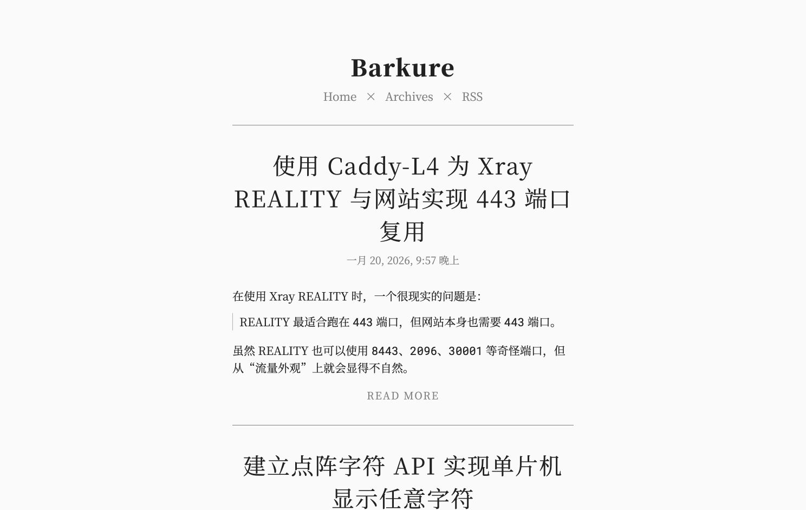

# Ascent

[](LICENSE)
[](https://www.getzola.org)

适合长文博客的 Zola 主题，使用思源宋体，自动跟随系统切换深浅色，支持按月归档和代码高亮。

**[在线预览](https://blog.barku.re/)**



## 安装

需要 Zola 0.23 或更新版本。在站点目录中运行：

```bash
git submodule add https://github.com/barkure/ascent-zola themes/ascent
```

在 `zola.toml` 中添加：

```toml
theme = "ascent"

[markdown.highlighting]
theme = "github-light"
style = "class"
```

### 内容目录

```text
content/
├── _index.md
├── archives/_index.md
└── posts/
    ├── _index.md
    └── my-post.md
```

`content/_index.md`：

```toml
+++
sort_by = "date"
paginate_by = 10
+++
```

`content/posts/_index.md`：

```toml
+++
transparent = true
render = false
+++
```

`content/archives/_index.md`：

```toml
+++
title = "归档"
template = "archive.html"
+++
```

## 写作

在 `content/posts/` 中新建文章：

```markdown
+++
title = "我的文章"
date = 2026-01-01
+++

文章摘要。

<!-- more -->

正文内容。
```

用 `<!-- more -->` 标记摘要结束位置。在代码块的语言名后加 `,linenos` 可显示行号，例如 `python,linenos`。

文章的可选设置放在文件头部的 `[extra]` 下：

```toml
[extra]
mathjax = true                    # 启用数学公式
og_image = "/images/cover.jpg"   # 分享预览图
photos = ["/images/photo.jpg"]   # 文章图片
```

如需标签或分类页面，在 `zola.toml` 中添加：

```toml
taxonomies = [{ name = "tags" }, { name = "categories" }]
```

## 配置

主题设置放在 `zola.toml` 的 `[extra]` 下，常用选项如下：

```toml
[extra]
favicon = "/favicon.ico"
menu = [
  { name = "首页", url = "/" },
  { name = "归档", url = "/archives" },
]
word_count = false       # 显示字数和阅读时间
```

需要 RSS 订阅时，在 `zola.toml` 顶层（所有 `[表名]` 之前）添加：

```toml
generate_feeds = true
```

主题会自动显示订阅入口，无需额外配置。

日期默认使用简体中文（`zh-cn`）；设置 `cjk_meridiem = true` 可显示中文时段。
完整选项及默认值见 [theme.toml](theme.toml)。

### 模板

在站点的 `templates/` 目录中放置同路径文件，即可覆盖主题模板，例如 `templates/partials/mathjax.html`。

## 致谢与许可

基于 CJ Quines 的 [Ascent](https://github.com/cjquines/hexo-theme-ascent)，适配 Zola。

[MIT](LICENSE) © 2020 Carl Joshua Quines, 2026 Barkure.
