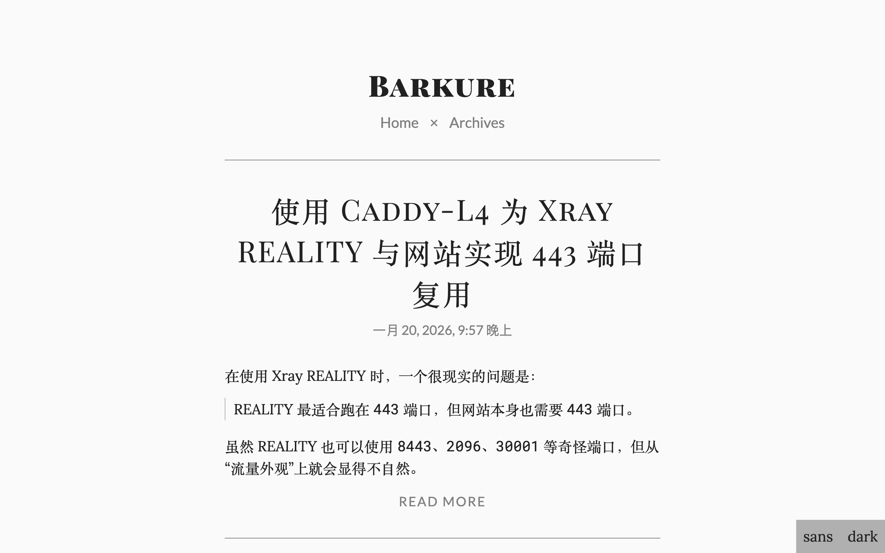

# Ascent

[](LICENSE)
[](https://www.getzola.org)

> An opinionated theme for blogs with long blocks of text. It aims to give the
> reader as smooth a reading experience as possible --- posts should read like
> magazine articles or newspaper features.
> --- [Ascent](https://github.com/cjquines/hexo-theme-ascent), by CJ Quines

The [Zola](https://www.getzola.org/) port of Ascent: the original design,
stylesheets and behaviour, ported 1:1 from the Hexo original.

**[Live demo](https://blog.barku.re/)** --- built with this theme.



## Features

* Magazine-style typography: Lora / Lato / Playfair Display SC stacks, a
  serif ⇄ sans toggle, and a light ⇄ dark toggle that remembers its choice
  in `localStorage`.
* Month-grouped archives with per-month accordions and a "Toggle all" switch.
* Excerpts on listings, with headings, images, rules and code blocks
  automatically kept out of the summary.
* Paginated home page and newer/older navigation between posts.
* Word counts and reading time.
* Tag and category pages reusing the archive listing.
* Per-page MathJax (client-side, v4) for posts that ask for it.
* Chinese-friendly dates: `date_locale = "zh-cn"` +
  `cjk_meridiem = true` reproduce moment.js'
  凌晨/早上/上午/中午/下午/晚上 day periods.
* Optional IntenseDebate comments and Google Analytics, as in the original.

## Requirements

* Zola ≥ 0.23.0 (Tera 2 components, Giallo syntax highlighting, absolute
  `get_url`/`permalink`).

## Installation

```bash
cd your-zola-site
git submodule add https://github.com/barkure/ascent-zola themes/ascent
```

```toml
# zola.toml
theme = "ascent"

[markdown.highlighting]
# the theme expects class-based highlighting
theme = "github-light"
style = "class"
```

### Content structure

The templates are built around a "transparent" posts section; create these
files in your site to get started:

```
content/
├── _index.md          # the home page: paginates the posts below
├── archives/_index.md # every post, grouped by month
└── posts/             # transparent + non-rendered: URLs stay /posts/<slug>/
    ├── _index.md
    └── my-post.md
```

```toml
# content/_index.md
+++
sort_by = "date"
paginate_by = 10
paginate_path = "page"
+++
```

```toml
# content/archives/_index.md
+++
title = "Archives"
template = "archive.html"
sort_by = "none"
+++
```

## Writing a post

```toml
+++
title = "My Post"
date = 2026-01-01T12:00:00+08:00

[extra]
mathjax = true            # load MathJax for $inline$ and $$display$$ math
og_image = "https://…"   # optional social image (or set the site-wide default)
photos = ["https://…"]   # optional image gallery
layout = "page"          # optional, changes the article id/class
+++
```

* `<!-- more -->` marks the end of the excerpt.
* Fenced code blocks get the original theme's line-number gutter with
  `,linenos`:

  ````markdown
  ```bash,linenos
  echo "hello"
  ```
  ````

* Taxonomies are opt-in; uncomment `taxonomies` in your `zola.toml` to enable
  tag and category pages.

## Options

Site-level, in your `zola.toml` under `[extra]` (defaults shown; they come
from the theme's `theme.toml`):

| key | default | meaning |
| --- | --- | --- |
| `favicon` | `""` | path to your favicon (the theme ships none), e.g. `/favicon.ico` |
| `menu` | Home, Archives | header links; `http(s)://` URLs automatically get `target="_blank" rel="noopener"` |
| `settings` | `true` | show the `dark` / `sans` toggles |
| `highlight` | `true` | load `css/highlight.css` |
| `excerpt_link` | `read more` | label of the read-more link, `""` to hide |
| `rss` | `""` | feed path for the header link, e.g. `/atom.xml` |
| `word_count` | `false` | show "N words × M minutes" |
| `date_locale` | `en` | locale passed to Zola's `date` filter (BCP-47) |
| `cjk_meridiem` | `false` | use 凌晨/早上/上午/中午/下午/晚上 instead of AM/PM |
| `og_image` | `""` | fallback `og:image` / `twitter:image` |
| `og_locale` | `""` | `og:locale` value, e.g. `zh_CN` |
| `intensedebate_acct` | `""` | IntenseDebate site key; enables comments when set |
| `google_analytics_acct` | `""` | Universal Analytics id; enables the snippet when set |
| `mathjax_url` | jsDelivr `mathjax@4/tex-svg.js` | MathJax bundle for `mathjax = true` pages |
| `mathjax_config` | TeX delimiters, `enableMenu: false` | inline `MathJax = {...}` object |

Page-level, in a post's front matter under `[extra]`: `mathjax`, `og_image`,
`photos`, `layout`.

### Overriding templates

Site templates win over theme templates. To change the MathJax loader for
example, create `templates/partials/mathjax.html` in the site root; the theme
falls back to its own everywhere else.

## Credits & license

Design, CSS and behaviour by [CJ Quines](https://cjquines.com/), from
[cjquines/hexo-theme-ascent](https://github.com/cjquines/hexo-theme-ascent);
the port changes nothing user-visible. The Zola port keeps the same licence
and attribution.

[MIT](LICENSE) © 2020 Carl Joshua Quines, 2026 Barkure.
